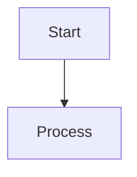

# Mermaid Studio

## Overview

Mermaid Studio is a packaged workflow for creating, validating, troubleshooting, and rendering Mermaid diagrams while preserving the upstream import context from `packages/skills-catalog/skills/(tooling)/mermaid-studio` in `https://github.com/tech-leads-club/agent-skills.git`.

Use this skill when the task requires a Mermaid deliverable, not just discussion: `.mmd` source, rendered artifacts such as SVG or PNG, syntax correction, diagram-type selection, or compatibility review for a target platform such as CLI, GitHub, GitLab, or another Markdown viewer.

This skill remains anchored in the imported support pack, but it adds stronger operational guidance for mode selection, safe rendering, version-sensitive syntax, accessibility metadata, and renderer compatibility.

## When to Use This Skill

Use this skill when the user needs one or more of the following:

- Create Mermaid source from a text description.
- Convert system, workflow, API, schema, or infrastructure concepts into Mermaid diagrams.
- Analyze code or repository structure and turn it into a flowchart, sequence diagram, ERD, class diagram, C4 diagram, or architecture diagram.
- Validate Mermaid syntax before committing docs or handing off artifacts.
- Render Mermaid to SVG, PNG, or ASCII.
- Troubleshoot Mermaid parse errors, layout problems, icon issues, or CLI rendering failures.
- Check whether a diagram that works locally will also work in GitHub, GitLab, or another Markdown renderer.

Do **not** use this skill for:

- Non-Mermaid image generation.
- General data plotting better handled by charting libraries.
- Freeform graphic design.
- Pure architecture consulting with no diagram output.
- General documentation writing when the task does not require Mermaid artifacts.

## Operating Table

| Situation | Mode | Start here | Why it matters |
| --- | --- | --- | --- |
| User needs a new diagram | Create | Decision matrix in this file, then diagram-specific references | Choose the right syntax family before writing Mermaid |
| User provides `.mmd` and wants a render | Render | `references/cli-rendering.md` | Rendering behavior depends on CLI, browser stack, and output target |
| User wants both source and artifact | Full pipeline | Workflow below | Ensures Create → Validate → Render → Verify is followed |
| Diagram works locally but not on GitHub/GitLab | Compatibility review | `references/renderer-compatibility.md` | Host renderers may lag Mermaid CLI or differ in supported features |
| Using C4, architecture, icons, or beta syntax | Version-aware review | `references/version-and-feature-compatibility.md` | Newer syntax families are renderer-version sensitive |
| Working with untrusted Mermaid or CI/container rendering | Security review | `references/security-and-sandboxing.md` | Mermaid CLI uses a headless browser stack and should be treated with care |
| Docs-quality output is required | Accessibility pass | `references/accessibility-and-labeling.md` | Title, description, and label clarity improve reuse and embedding |
| Need upstream lineage or import review | Provenance review | `references/omni-import-playbook.md`, `scripts/omni_import_print_origin.py` | Preserves import context for audit and handoff |

## Workflow

### Mode selection

Choose the narrowest mode that satisfies the request:

| Mode | Trigger | Deliverable |
| --- | --- | --- |
| Create | “Draw”, “model”, “design”, “show me as Mermaid” | `.mmd` source |
| Validate | “Check/fix this Mermaid”, parser error, syntax review | corrected `.mmd` and error explanation |
| Render | “Convert/render/export this Mermaid” | SVG, PNG, ASCII, or equivalent output |
| Full pipeline | ambiguous or end-to-end request | source + validation + rendered artifacts |
| Compatibility review | “Will this work on GitHub/GitLab/docs site?” | compatibility assessment and fallback recommendation |

Default to **Full pipeline** when the user clearly wants a completed diagram artifact and intent is ambiguous.

### Execution steps

1. **Scope the request**  
   Identify the subject, intended audience, target platform, and expected output format.

2. **Choose the diagram family**  
   Use the decision matrix below. If multiple types fit, propose 2-3 options and explain the tradeoff briefly.

3. **Check feature sensitivity**  
   Before using C4, `architecture-beta`, icon packs, or newer/beta diagram types, review `references/version-and-feature-compatibility.md`.

4. **Draft minimal Mermaid first**  
   Start with the smallest valid diagram that captures the core structure. Expand only after the base version validates.

5. **Add configuration deliberately**  
   Prefer YAML frontmatter for reusable file-level configuration. Use init directives when the diagram will be embedded inline and frontmatter is not practical.

6. **Add accessibility metadata when appropriate**  
   For diagrams intended for docs, shared files, or long-lived artifacts, add title/description metadata. See `references/accessibility-and-labeling.md`.

7. **Validate before rendering**  
   Run:

   ```bash
   node $SKILL_DIR/scripts/validate.mjs <file.mmd>
   ```

   If validation fails, isolate a minimal reproduction before making broad edits.

8. **Render only after validation passes**  
   Use the smallest command that produces the requested format. See `references/cli-rendering.md`.

9. **Verify in the target environment**  
   If the destination is GitHub, GitLab, or another Markdown renderer, compare local success with target-host compatibility using `references/renderer-compatibility.md`.

10. **Package outputs cleanly**  
    When rendering is requested, provide both the `.mmd` source and rendered output. Prefer adjacent naming such as `auth-flow-sequence.mmd` and `auth-flow-sequence.svg`.

## Diagram Type Decision Matrix

| User describes... | Diagram type | Syntax keyword |
| --- | --- | --- |
| Process, algorithm, branching workflow | Flowchart | `flowchart TD` or `flowchart LR` |
| API calls, request/response, actor interactions | Sequence | `sequenceDiagram` |
| Database schema and cardinality | ERD | `erDiagram` |
| Classes, interfaces, inheritance | Class | `classDiagram` |
| State transitions or lifecycle | State | `stateDiagram-v2` |
| High-level system context | C4 Context | `C4Context` |
| Apps, services, databases, containers | C4 Container | `C4Container` |
| Internal service/module breakdown | C4 Component | `C4Component` |
| Scenario-driven interaction steps | C4 Dynamic | `C4Dynamic` |
| Deployment topology | C4 Deployment | `C4Deployment` |
| Cloud/service topology with icons | Architecture | `architecture-beta` |
| Timeline/project scheduling | Gantt | `gantt` |
| Historical sequence of events | Timeline | `timeline` |
| Idea hierarchy | Mindmap | `mindmap` |
| Branch history | Git graph | `gitGraph` |
| Proportional distributions | Pie | `pie` |
| Journey or experience steps | Journey | `journey` |
| Resource flow quantities | Sankey | `sankey-beta` |
| Grid/layout-oriented modeling | Block | `block-beta` |
| Packet/header structure | Packet | `packet-beta` |
| Requirement traceability | Requirement | `requirementDiagram` |

Readability limits such as “keep diagrams under ~15 nodes” are **house-style heuristics**, not Mermaid hard limits.

## When to Load References

Load only the references that change the outcome:

- `references/c4-architecture.md` for C4 diagrams.
- `references/aws-architecture.md` for cloud and icon-heavy architecture diagrams.
- `references/code-to-diagram.md` before repository analysis.
- `references/themes.md` for theme selection or custom palette work.
- `references/troubleshooting.md` for existing imported troubleshooting notes.
- `references/cli-rendering.md` for rendering commands and environment expectations.
- `references/security-and-sandboxing.md` when handling untrusted diagrams or CI/container rendering.
- `references/renderer-compatibility.md` when the final destination is a Markdown host, not just local CLI output.
- `references/accessibility-and-labeling.md` when diagrams will be embedded in docs or shared externally.
- `references/version-and-feature-compatibility.md` when using newer or beta syntax families.

## Authoring Guidance

### Prefer minimal valid structure first

Start with a known-good minimal form before adding style, subgraphs, icon packs, or advanced layout instructions.

### Configuration approach

Preferred order:

1. YAML frontmatter for reusable file-level config.
2. Init directives for inline snippets or when frontmatter is impractical.
3. Avoid mixing multiple conflicting config mechanisms unless required.

Example frontmatter pattern:

```yaml
---
config:
  theme: base
  look: handDrawn
---
```

Then the diagram body:



### Naming and labeling

- Use descriptive node IDs when the syntax family needs IDs.
- Keep labels short and readable.
- Put detailed explanation in surrounding prose, not overcrowded node text.
- Use relationship labels that explain the action, protocol, or dependency.

### Layout guidance

- Prefer `TD` for hierarchical or top-down flows.
- Prefer `LR` for pipelines and sequential left-to-right reading.
- Use `subgraph` or boundaries for logical grouping.
- Split dense diagrams into multiple focused diagrams when readability drops.

## Rendering

### Setup

Run first-run setup only when needed:

```bash
bash $SKILL_DIR/scripts/setup.sh
```

### Validation

```bash
node $SKILL_DIR/scripts/validate.mjs <file.mmd>
```

### Single renders

```bash
# SVG
node $SKILL_DIR/scripts/render.mjs -i diagram.mmd -o diagram.svg

# PNG
node $SKILL_DIR/scripts/render.mjs -i diagram.mmd -o diagram.png --width 1200

# ASCII
node $SKILL_DIR/scripts/render-ascii.mjs -i diagram.mmd

# Architecture/icons when supported by the packaged renderer
node $SKILL_DIR/scripts/render.mjs -i diagram.mmd -o diagram.svg --icons logos,fa
```

### Batch rendering

```bash
node $SKILL_DIR/scripts/batch.mjs \
  --input-dir ./diagrams \
  --output-dir ./rendered \
  --format svg \
  --theme default \
  --workers 4
```

For operational details and environment caveats, see `references/cli-rendering.md`.

## Examples

### Example 1: Create a new sequence diagram from a request description

```text
Use @mermaid-studio to create a Mermaid sequence diagram for a login flow with browser, API, auth service, and database. Return the `.mmd` source first, validate it, then render SVG if the syntax passes.
```

Expected outcome:

- a `sequenceDiagram` source file
- validation step performed
- SVG render produced if validation succeeds

### Example 2: Validate and debug an existing Mermaid file

```bash
node skills/mermaid-studio/scripts/validate.mjs ./docs/checkout-flow.mmd
```

Expected outcome:

- explicit parse success, or
- a narrowed syntax error to fix before rendering

### Example 3: Render a validated diagram to SVG

```bash
node skills/mermaid-studio/scripts/render.mjs -i ./docs/checkout-flow.mmd -o ./docs/checkout-flow.svg
```

Expected outcome:

- rendered SVG alongside the source file

### Example 4: Use a minimal repro to isolate parser issues

```bash
node skills/mermaid-studio/scripts/validate.mjs skills/mermaid-studio/examples/minimal-repro-diagrams/flowchart-basic.mmd
```

Expected outcome:

- confirms whether the renderer/tooling works on a known-good sample before blaming the user diagram

### Example 5: Inspect import provenance before review

```bash
python3 skills/mermaid-studio/scripts/omni_import_print_origin.py
```

Expected outcome:

- source repository, branch, commit, and imported path for audit and handoff

## Best Practices

### Do

- Create the smallest useful diagram first, then expand.
- Treat YAML frontmatter as the preferred reusable configuration layer.
- Keep `.mmd` source with rendered outputs.
- Verify target-host compatibility before promising that a locally valid diagram will render in GitHub or GitLab.
- Add title/description metadata for documentation-quality outputs.
- Use readability heuristics such as splitting dense diagrams into focused views.
- Keep relationship labels meaningful and concise.
- Use minimal reproductions when debugging parser failures.
- Preserve provenance and support-pack context when the task depends on the imported upstream workflow.

### Don’t

- Assume local CLI success guarantees GitHub/GitLab success.
- Loosen Mermaid security settings by default for untrusted input.
- Use `--no-sandbox` casually; reserve it for constrained, trusted environments and document why.
- Treat architecture/C4/beta syntax as universally supported without checking renderer version.
- Overcrowd diagrams with long prose labels.
- Present style heuristics as if they were Mermaid parser requirements.

### Security notes

Mermaid rendering is not risk-free operationally:

- Mermaid CLI relies on a headless browser stack.
- Security-sensitive options such as `securityLevel` and `htmlLabels` can change trust assumptions.
- Untrusted Mermaid or untrusted config should be handled cautiously.
- CI/container rendering may require environment-specific browser troubleshooting.

Read `references/security-and-sandboxing.md` before changing trust-related settings or browser sandbox behavior.

## Troubleshooting

### Problem: Mermaid validates in one place but not another

**Symptoms:** The diagram works in Mermaid Live or local CLI but fails in GitHub, GitLab, or another Markdown viewer.  
**Solution:** Check `references/renderer-compatibility.md`. Verify the target host before using newer syntax, icon packs, or advanced config. If host support is uncertain, provide SVG/PNG fallbacks.

### Problem: Parse error near brackets, quotes, or frontmatter

**Symptoms:** Validation fails with a parser error near labels, braces, YAML frontmatter, or the first diagram line.  
**Solution:** Reduce to a minimal reproduction. Confirm the correct diagram keyword is used, frontmatter is valid YAML, and the diagram body starts cleanly after frontmatter. Compare against the known-good files in `examples/minimal-repro-diagrams/`.

### Problem: Architecture or C4 syntax fails unexpectedly

**Symptoms:** `architecture-beta`, C4, or other newer syntax is rejected despite looking valid.  
**Solution:** Review `references/version-and-feature-compatibility.md`. Confirm the local renderer supports the syntax family used. If support is unclear, fall back to a more widely supported diagram type or provide a rendered artifact instead of relying on host preview.

### Problem: AWS or icon-based architecture diagrams show missing icons

**Symptoms:** Diagram renders but icons do not appear, or host preview drops icon-based nodes.  
**Solution:** Confirm whether the rendering path supports icon pack registration. Use the packaged `--icons` flag where appropriate. If the target host does not support icon packs, switch to built-in icons or plain labels.

### Problem: `mmdc` or the packaged renderer fails to launch Chromium

**Symptoms:** Browser launch errors, missing shared library errors, sandbox errors, or renderer failure in CI/container environments.  
**Solution:** Review `references/cli-rendering.md` and `references/security-and-sandboxing.md`. Capture OS, Node version, CLI version, error text, and whether the run is local, CI, or Docker. Only use no-sandbox workarounds in trusted constrained environments and document the exception.

### Problem: Diagram layout is technically valid but unreadable

**Symptoms:** Overlapping edges, crowded labels, or visually dense output.  
**Solution:** Change direction (`TD`/`LR`), shorten labels, split the diagram, add grouping, or move to multiple focused diagrams. Treat node-count and relationship-count recommendations as readability heuristics, not hard parser limits.

### Problem: The imported workflow context was skipped

**Symptoms:** The answer ignores the imported support pack, provenance, or workflow-specific references.  
**Solution:** Re-open `references/omni-import-checklist.md`, `references/omni-import-playbook.md`, and the source manifest/origin script. Re-state provenance before continuing.

## Related Skills

Use a neighboring skill when the work stops being primarily Mermaid production:

- `@accessibility` when the task becomes a broader accessibility review of docs and embedded diagrams.
- `@documentation` when the main job is docs-site structure or prose authoring around diagrams.
- `@architecture-review` when the user primarily needs system-design critique rather than diagram production.
- `@ci-cd` when the main work is automating diagram validation/rendering in pipelines.
- `@codebase-analysis` when substantial repository analysis is needed before diagramming begins.

## Additional Resources

### Local references

- [CLI rendering guide](references/cli-rendering.md)
- [Security and sandboxing](references/security-and-sandboxing.md)
- [Renderer compatibility](references/renderer-compatibility.md)
- [Accessibility and labeling](references/accessibility-and-labeling.md)
- [Version and feature compatibility](references/version-and-feature-compatibility.md)
- [Imported intake checklist](references/omni-import-checklist.md)
- [Imported review rubric](references/omni-import-rubric.md)
- [Imported workflow playbook](references/omni-import-playbook.md)
- [Imported source summary](references/omni-import-source-summary.md)

### Minimal repro examples

- [Flowchart smoke test](examples/minimal-repro-diagrams/flowchart-basic.mmd)
- [Sequence smoke test](examples/minimal-repro-diagrams/sequence-basic.mmd)
- [ERD smoke test](examples/minimal-repro-diagrams/erd-basic.mmd)
- [C4 smoke test](examples/minimal-repro-diagrams/c4-basic.mmd)
- [Architecture smoke test](examples/minimal-repro-diagrams/architecture-basic.mmd)

### Scripts and provenance

- [Print origin details](scripts/omni_import_print_origin.py)
- [List support pack](scripts/omni_import_list_support_pack.py)

## Imported Notes Preserved

### C4 styling guidance

The imported workflow strongly prefers soft relationship styling for C4 diagrams. Keep that preference, but treat limits such as relationship counts as readability guidance rather than Mermaid language rules.

Recommended pattern:

```text
UpdateRelStyle(fromAlias, toAlias, $textColor="#475569", $lineColor="#94a3b8")
UpdateLayoutConfig($c4ShapeInRow="3", $c4BoundaryInRow="1")
```

### Output conventions

- Save `.mmd` source files alongside rendered outputs.
- Use stable names such as `{purpose}-{type}.mmd`.
- For batch rendering, preserve the input basename and change only the extension.
- When rendering is requested, deliver both source and rendered files.
